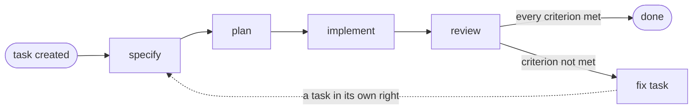

# taskmd

taskmd keeps tasks as plain Markdown files, one file per task, and generates everything else from
them: the index, the far end of every link, what is blocked, and what to do next. It ships a
validator, needs no dependencies, and does not assume the work is software. Research, a course, a
deck and an ops runbook all fit.

## Using it

You talk to Claude, and the commands below are what it runs underneath.

| What you say | What happens |
| :--- | :--- |
| *What should I work on next?* | `taskmd list --open --limit 1` picks the task by the project's ordering rule, and `taskmd context` reads that one task. It never opens the rest of the folder. |
| *Add a task for drafting the onboarding email sequence* | The next id is taken, the template is copied, and the front-matter and any links are written in the same edit. Then the index is regenerated. |
| *Specify T-014* | The specify phase is worked and then it stops. One phase per request, so it stops there instead of carrying on into planning just because planning is next. |
| *Take T-014 through to done* | Asking for the whole lifecycle is what authorizes it: specify, plan, implement, review, in that order. |
| *Audit the handbook chapters and raise a task per finding* | An audit produces one umbrella task and one child task per finding. Nothing is fixed where it was found, which is what keeps a fix traceable. |

## The lifecycle



Four phases, mandatory however small the task. Each one has a written exit criterion, and the
criterion is what counts as enough: `specify` ends when the acceptance
criteria are agreed, `plan` ends when every step names an output, `implement` ends when the outcome
has been checked by being used and the evidence is written down, and `review` ends when every
criterion is either met or carries a child task that will meet it.

Phase and status are separate. The phase says where the work reached; the status says whether it can
move. A task waiting on someone keeps the phase it reached and never moves backwards to record an
obstacle.

## What a task is

A file with front-matter for the facts and Markdown for the content:

```markdown
---
id: T-014
title: Draft the onboarding email sequence
type: deliverable
status: in_progress
phase: implement
parent: T-009
blocked_by: [T-011]
related: [T-006]
work_package: none
owner: maintainer
business_value: high
effort: m
created: 2026-08-04
updated: 2026-08-09
deliverables: [drafts/onboarding-1.md]
---

# T-014 ...
```

Nothing else is stored. **Store the forward edge, derive the rest**: T-011 says nothing about T-014,
and both ends of that link still show up on both tasks, because the tool computes the other end. The
same goes for children, for what a task blocks, for the index, and for which task comes next. Nobody
maintains a list by hand, so no list can be wrong.

The field names and their allowed values are configuration rather than code. A project keeps the
shipped schema or copies it to `.taskmd/config.md` and edits it there.

## The commands

| Command | What it does |
| :--- | :--- |
| `taskmd context <id>` | Everything needed to start that one task, and nothing else |
| `taskmd list --open --limit 1` | What to work on next, by the project's own ordering rule |
| `taskmd index` | Regenerates the task index |
| `taskmd check` | Validates ids, vocabularies, references and links |

They find the project by walking up from wherever they are run, so they work from a subdirectory
too. Pass `--root <path>` to override the project they find.

`list` filters on any stored field or link name (`taskmd list --status blocked`,
`taskmd list --parent T-009`), and `--json` turns it into a script's input.

## Install

There are two shapes. Both carry the method document and both backend bindings; the plugin adds the
manifest and the `bin/` entry point.

### As a plugin (the route to prefer)

```bash
claude plugin marketplace add uchimata2/taskmd
claude plugin install taskmd@taskmd
```

Claude Code puts an enabled plugin's `bin/` directory on `PATH`, so you type `taskmd`. Setting up a
project is one folder, and no command creates it for you:

```bash
mkdir tasks
taskmd check
```

```
OK - 0 task(s), vocabulary valid, references resolve, no broken links
```

Run outside a project, `taskmd check` says so and exits 2 instead of reporting a clean tree it never
opened.

### As a plain skill

Copy [`plugin/skills/taskmd/`](plugin/skills/taskmd) into your skills directory, so that it lands at
`~/.claude/skills/taskmd/`. That folder is self-contained: 21 files, no path to edit, and nothing
cited that it does not carry.

A copied skill gets no `PATH` entry, because that mechanism belongs to plugins. This shape therefore
runs the launcher inside the folder:

```bash
mkdir tasks
~/.claude/skills/taskmd/taskmd.sh check
```

```powershell
& ~\.claude\skills\taskmd\taskmd.ps1 check
```

Both print the same line as the plugin does. The two shapes name different commands on purpose.

## What it costs to start a task

Starting one task on this repository, with the tool and without it:

| Reading | Bytes |
| :--- | ---: |
| The task file, the project conventions, the generated index, and every task it links to | 156,901 |
| `taskmd context T-029` | 693 |

That is 0.44%, and it counts only the links the task stores. What waits *on* a task is derived and
written nowhere, so a session without the tool cannot know it without reading every task file, which
here is 1,274,604 bytes.

Two other things follow from deriving rather than storing. An inverse edge cannot go stale, because
there is no second copy to update. And a link recorded on either end is visible from both, so nobody
has to know which end owns it.

## What it is not

taskmd runs no server, daemon, watcher or database. It has no GUI and no web view, because the files
are the interface and the terminal is the view. It never touches the network. There is no query
language, no migration tooling, no notifications or scheduling, and no time tracking, velocity or
capacity. Two estimated fields exist for one purpose, ordering the listing, and either can be
switched off.

Nor is there an automatic fixer. Derived fields cannot go stale, because they are not stored.

## Backends

**Changing backend changes the binding, not the method.** A project that moves from local files to
GitHub Issues keeps the same lifecycle, the same edges and the same rules, and the binding absorbs
the backend's realities such as server-assigned ids or a missing soft-link field. The package ships
[`METHOD.md`](plugin/skills/taskmd/docs/METHOD.md), which names no backend, the contract a binding
implements ([`BINDING.md`](plugin/skills/taskmd/docs/BINDING.md)), and both bindings written against
it ([`docs/bindings/`](plugin/skills/taskmd/docs/bindings)): local Markdown, which is what the
commands above operate on, and GitHub Issues, which was walked on a live repository.

Each binding opens by stating the assumptions it makes about the adopting project, so you can see in
thirty seconds whether one of them is false for you.

## Scale and platforms

At its shipped id width taskmd handles up to 999 tasks with every command finishing in under a
second (measured at 999 tasks: `check`, the slowest, took 0.83 s), and a project that raises
`id_width` to go further pays 1.34 s for `check` at 2000 tasks and up to 3.9 s at 5000.

Run on Windows and on Linux, where a fresh clone regenerated a byte-identical index. macOS is
untested rather than unsupported: nothing in the tool is known to depend on the platform, and nobody
has run it there.

The implementation is standard-library Python, with bash and PowerShell launchers that hold no
logic. It needs no install step, no configuration and no dependencies.

## Documentation

| Read | For |
| :--- | :--- |
| [`METHOD.md`](plugin/skills/taskmd/docs/METHOD.md) | The working method: the lifecycle, the edge kinds, and what each phase has to produce |
| [`adopt.md`](plugin/skills/taskmd/adopt.md) | Setting up a project that has no tasks yet |
| [`config.md`](plugin/skills/taskmd/taskmd/defaults/config.md) | The schema, which is also the only description of what a config may hold |
| [`BINDING.md`](plugin/skills/taskmd/docs/BINDING.md) | Writing or adopting a binding for another backend |
| [`SCOPE.md`](docs/SCOPE.md) | The goal, the numbered requirements, and what is deliberately out |

## License

MIT. See [`LICENSE`](LICENSE).
